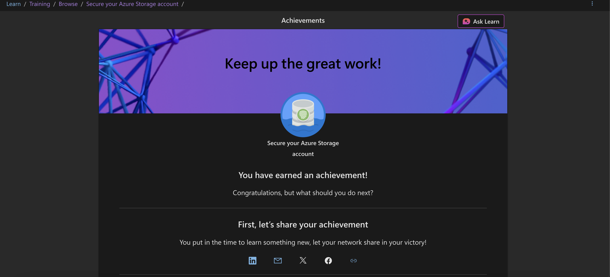

# 🧪 Cyber-Lab — Hands-On Security Portfolio  
*Built to land a SOC Analyst / Cloud Security internship in 2026.*

**Last updated:** **2025-08-06**

---

## 🌟 Current Focus Areas
- ☁️ **Cloud security** (Azure now; AWS next)
- 🛡️ **SOC / Blue-Team skills** (log analysis, detection rules)
- 🔐 **Identity & access management** (RBAC, Key Vault)
- 📊 **SIEM tooling** (Splunk, Sentinel, ELK)
- 🧠 Continuous learning aligned to **Security+**, **AZ-900**, and future certs

---

## 📂 Directory of Labs & Modules

| Path | Type | Skills Practiced |
|------|------|-----------------|
| [`azure/secure-storage-rbac-keyvault`](./azure/secure-storage-rbac-keyvault) | Microsoft Learn **module** | RBAC, Key Vault, encryption at rest |

*(More folders will appear here as I complete additional labs.)*

---

## 🛠 Tools & Platforms
- **Microsoft Azure** sandbox environments  
- **TryHackMe** (Blue-Team track) *(queued)*  
- **Splunk Free / Fundamentals 1** *(queued)*  
- **Linux (Ubuntu VM)**, Wireshark, Nmap, Burp Suite  

---

## 🚧 In Progress
- Azure Sentinel alerting lab — **25 % complete**  
- TryHackMe SOC Level 1 — **0 %** (scheduled)  
- Splunk brute-force detection dashboard — **10 %**

---

## 📜 Certifications
| Status | Certification |
|--------|---------------|
| ✅ | **AZ-900** — Microsoft Azure Fundamentals |
| ✅ | **CompTIA Security+** |
| 🔄 | Splunk Core Certified User *(studying, target Oct 2025)* |

---

## 🙋‍♂️ About Me
First-year Cybersecurity AS student at **Chaffey College**, documenting every step toward a career in cloud security and Blue-Team operations.

> **Let’s connect:** [LinkedIn](https://www.linkedin.com/in/anthony-williams-680406378/)
