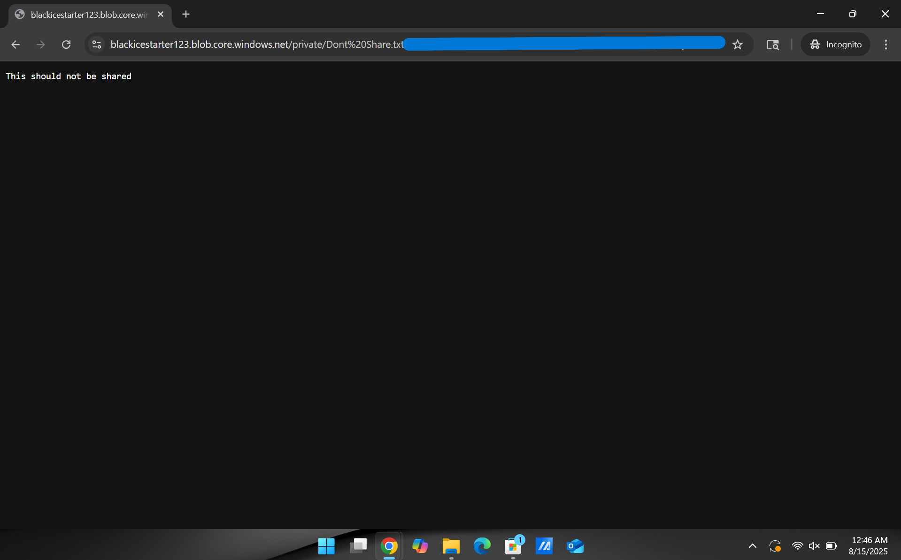
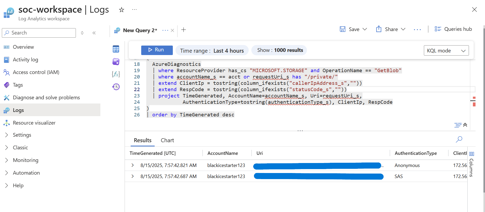

# Azure — SAS Blob Leak (Detect, Log, Remediate)

**Path:** `azure/sas-blob-leak-detect-remediate`  
**Type:** Storage security lab  
**Skills:** Blob SAS, Diagnostic settings, KQL (Log Analytics), Key rotation  
**Time:** ~20–30 min • **Cost:** pennies

## Goal
Create a **private** container, generate a **read-only SAS URL** (the “leak”), prove external access in **Incognito**, send Blob logs to **Log Analytics**, then **revoke** the leak by rotating the access key.

---

## Prereqs
- Azure subscription (Azure for Students works)
- One **Resource Group** in **eastus2**
- A **Log Analytics workspace** in the same region (e.g., `soc-workspace`)

---

## Steps

### 1) Storage account (policy-friendly)
1. Portal → **Storage accounts → Create**  
2. **Region:** `eastus2` • **Redundancy:** LRS  
3. **Advanced:** **Allow blob public access = Disabled**  
4. **Create** → open the account when done.

> If your org policy already disables public access at the account level, perfect — we’ll use a SAS link.

---

### 2) Private container + test blob
1. Storage account → **Data storage → Containers → + Container**  
   - **Name:** `private` • **Public access level:** *Private (no anonymous)*  
2. Open `private` → **Upload** a text file `Dont Share.txt` with:  
   `This should NOT be shared.`

---

### 3) Generate a SAS URL (the “leak”)
1. Click the blob → **Generate SAS** (or **Shared access tokens**):  
   - **Signing method:** Account key (**Key 1**)  
   - **Permissions:** Read  
   - **Expiry:** ~30–60 min  
   - **Protocol:** HTTPS only  
2. **Generate SAS token and URL** → copy the **Blob SAS URL**.  
3. Open a **new Incognito/Private** window → paste the SAS URL → the file should render.  
   *(Redact the token before sharing — everything after `?`.)*

---

### 4) Turn on logging to Log Analytics
1. If needed, create a workspace: **Log Analytics workspaces → Create** (`eastus2`).  
2. Storage account → **Monitoring → Diagnostic settings → + Add diagnostic setting**  
   - **Name:** `toLAW`  
   - **Destination:** **Send to Log Analytics workspace** → select your workspace  
   - **Category groups:** **allLogs** for **Blob** (Read/Write/Delete) → **Save**  
3. Hit the **same SAS URL** again in Incognito to generate a log.

---

### 5) Hunt in KQL (prove the SAS read)
**Log Analytics workspace → Logs**, set **Time range: Last 4 hours**, run:

    let acct = "<YOUR_STORAGE_ACCOUNT>"; // e.g., blackicestarter123
    union isfuzzy=true
    (
      StorageBlobLogs
      | where OperationName == "GetBlob" and AccountName == acct
      | extend Uri = tostring(column_ifexists("Uri",""))
      | extend RespCode = toint(coalesce(column_ifexists("StatusCode",""), column_ifexists("ResponseCode","")))
      | project TimeGenerated, AuthenticationType, Uri, RespCode
    ),
    (
      AzureDiagnostics
      | where ResourceProvider has_cs "MICROSOFT.STORAGE" and OperationName == "GetBlob" and accountName_s == acct
      | extend Uri = tostring(column_ifexists("requestUri_s",""))
      | extend RespCode = toint(column_ifexists("statusCode_s",""))
      | project TimeGenerated, AuthenticationType=tostring(authenticationType_s), Uri, RespCode
    )
    | order by TimeGenerated desc

> Expect **AuthenticationType = SAS** for your blob. Ignore **Anonymous /favicon.ico** rows (browser noise).

---

### 6) Remediate: kill the SAS (UI **or** code)

**UI (quick):** Storage account → **Security + networking → Access keys** → **Rotate** the key you used (usually **key1**). Then refresh the **same SAS URL** in Incognito → should show **AuthenticationFailed / Signature did not match**.

**Code alternative — Azure CLI (bash):**

    # set your values
    RG="cloud-sec-starter-rg"
    STG="<YOUR_STORAGE_ACCOUNT>"   # e.g., blackicestarter123
    KEY_TO_ROTATE="primary"        # primary == key1, secondary == key2

    # rotate the key (invalidates SAS signed with it)
    az storage account keys renew \
      --resource-group "$RG" \
      --account-name "$STG" \
      --key "$KEY_TO_ROTATE"

    # test the SAME SAS URL now fails
    SAS_URL="<PASTE_YOUR_OLD_SAS_URL>"
    curl -I -H "Cache-Control: no-cache" "$SAS_URL"    # expect 401/403

**Code alternative — Az PowerShell:**

    $rg  = "cloud-sec-starter-rg"
    $stg = "<YOUR_STORAGE_ACCOUNT>"   # e.g., blackicestarter123
    $key = "key1"                     # use "key2" if needed
    $sas = "<PASTE_YOUR_OLD_SAS_URL>"

    New-AzStorageAccountKey -ResourceGroupName $rg -Name $stg -KeyName $key | Out-Null
    try {
      $r = Invoke-WebRequest -Uri $sas -Method Head -UseBasicParsing
      $r.StatusCode
    } catch {
      $_.Exception.Response.StatusCode.value__  # expect 401/403
    }

> If your SAS used a **Stored access policy** (`si=` in the URL), delete/expire that policy on the container.  
> If it’s a **User Delegation SAS** (`skoid/sktid` fields), key rotation doesn’t revoke it—use short expirations or regenerate delegation keys.

---

## Evidence (assets/)
- 03_container_private.png — Container is Private, blob present  
- 04_blob_before_sas.png — Blob before SAS  
- 05_generate_sas_settings.png — SAS settings (Read, short expiry)  
- 06_incognito_sas_access_ok.png — SAS works in Incognito (token redacted)  
- 07a_diagsettings_config.png — Diagnostic setting being created  
- 07_diagsettings_blob_enabled.png — Blob diagnostics enabled  
- 08_kql_getblob_auth_sas.png — KQL shows GetBlob with AuthenticationType = SAS  
- 10_accesskeys_after.png — Access keys after rotation (timestamp updated)  
- 11_incognito_sas_access_denied.png — SAS denied after rotation

> **Redaction:** never commit a live SAS token; black-box everything after `?`.

---

## Cleanup
- **Resource groups →** delete the lab RG to stop charges.

## Troubleshooting
- **No logs yet:** ensure *Blob* categories are selected, hit the SAS again, wait 1–3 min.  
- **KQL columns missing:** use the query above as-is (schema-safe).  
- **SAS still works after rotation:** rotate the other key; you likely signed with it.
