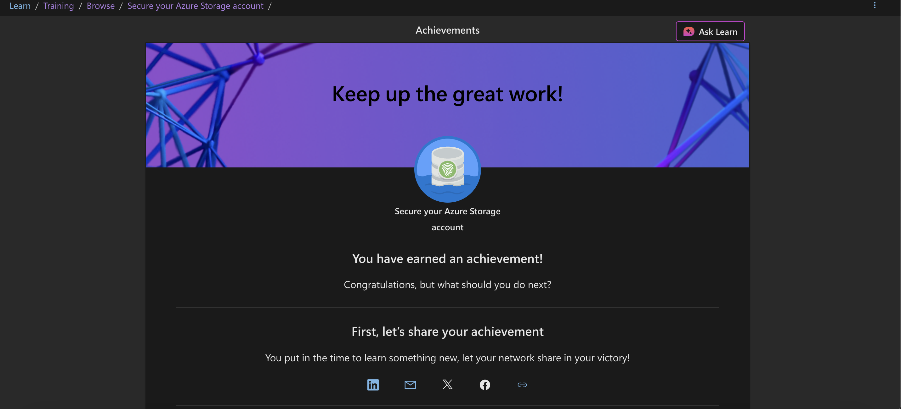

# 🔐 Microsoft Learn Module — Secure Azure Storage with RBAC & Key Vault

> **Type:** Guided Microsoft Learn module (not an open-ended lab)

## 🌟 Why I Did This
- Learn how Azure **Role-Based Access Control (RBAC)** enforces least-privilege access.
- Understand how **Azure Key Vault** manages customer-controlled encryption keys.
- Practice securing an **Azure Storage Account** in a free sandbox environment.

## 🧰 Key Tasks Completed
1. Created an Azure Storage Account in the Learn sandbox.
2. Assigned the **Storage Blob Data Reader** RBAC role to restrict access.
3. Deployed an Azure Key Vault and generated a customer-managed key.
4. Configured the Storage Account to use the Key Vault key for encryption at rest.

## 🧠 What I Learned
| Area | Takeaway |
|------|----------|
| IAM/RBAC | Role assignments are applied to a *scope* (subscription, RG, resource). |
| Key Vault | Separates key management from data storage; supports rotation & auditing. |
| Encryption | Customer-managed keys satisfy stricter compliance requirements. |

## 📸 Evidence

> Microsoft Learn shows a completion badge because this module is a guided, read-through exercise rather than an interactive lab.

## ▶️ Next Steps
- Re-create this setup in my personal Azure subscription (non-sandbox) to cement the process.  
- Add monitoring with **Azure Monitor** or **Sentinel** to alert on unauthorized access attempts.  
- Combine with a **Defender for Storage** lab to practice threat detection.

---

